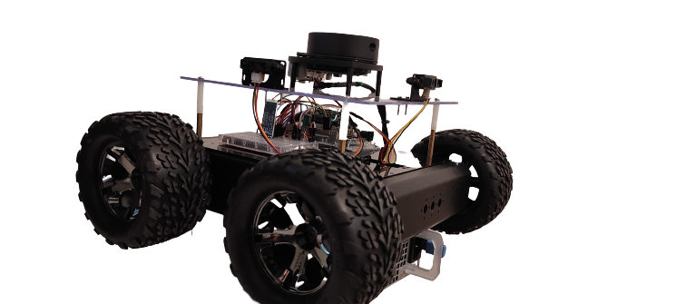

= [Projet Fil Rouge] Partie 3 - BTYT Robot

Auteurs :
Constant ROUX,
Peter PIRIOU--DEZY,
Guillaume ROUSSIN,
Julian TRANI, 
Pierre PINÇON,
Baptiste RAMONDA

Dernière mise à jour : 22/05/2022

== Installation 

Tous les fichiers du projet pour le code embarqué du **Robot BTYT**.
Le projet utilise `PlatformIO` qui peut être trouvé sur VSCode Marketplace.

Voici un petit aperçu du robot de l'application :

